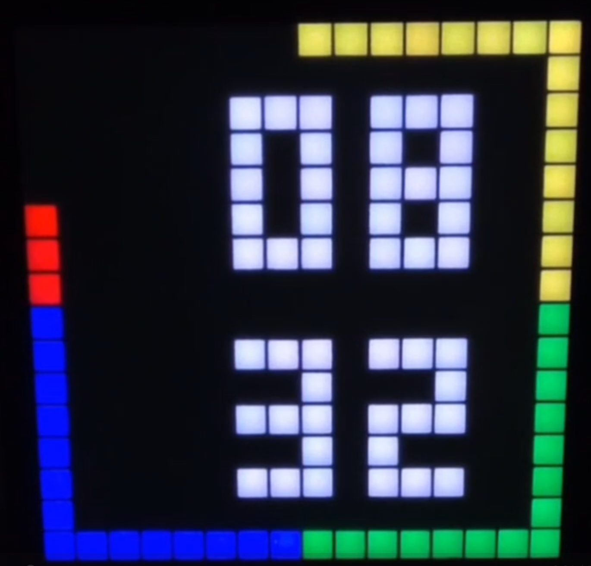
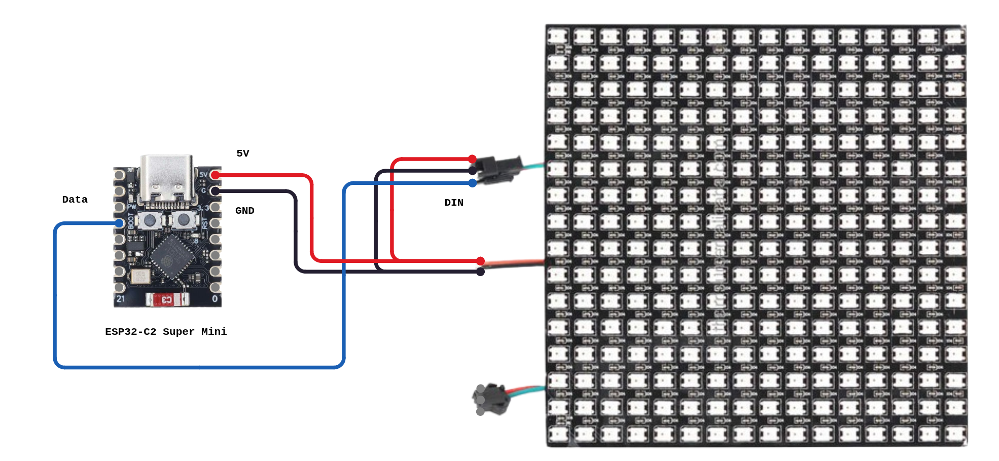
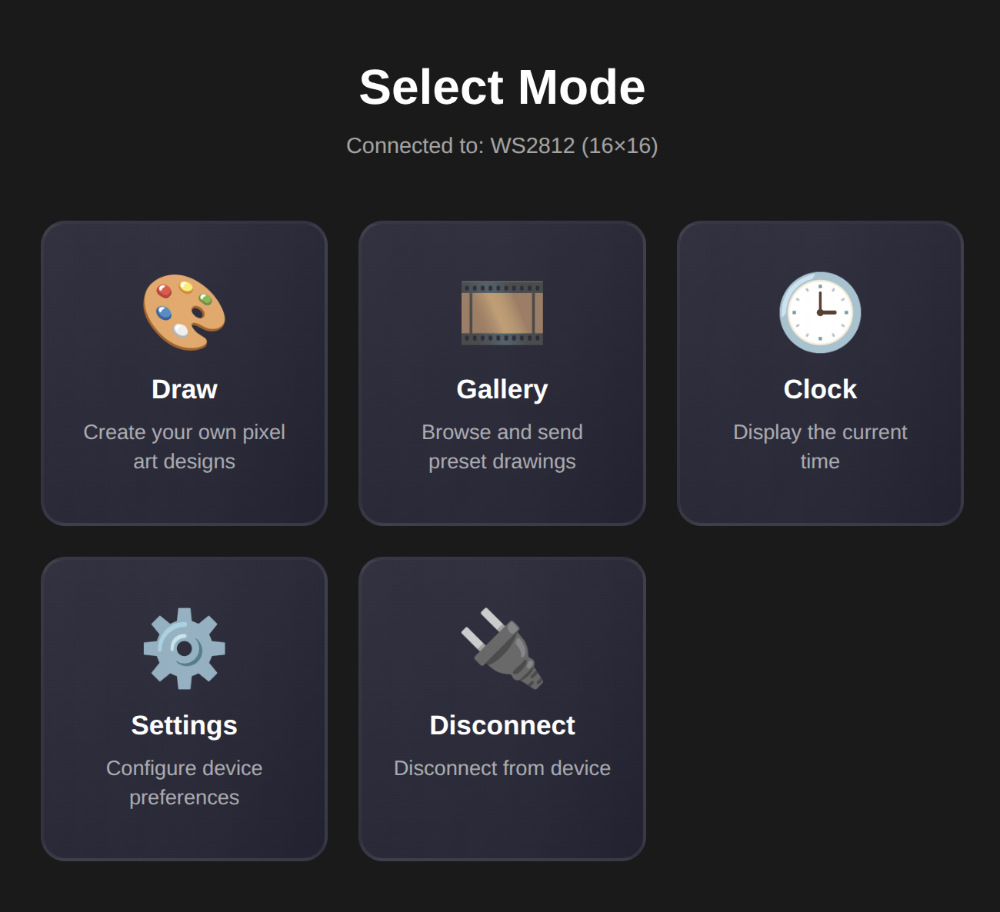
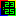
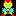

# PixelBox

A Bluetooth-controlled PixelBox project powered by ESP32.
- Draw pixel art instantly (16x16)
- Play animations
- Display a clock
- Tetris
- Snake
- Flappy Bird
- Arkanoid



## Demo

▶️ [See video for clock mode](https://github.com/user-attachments/assets/048136df-9e7c-436d-b4ce-061c26e4e01e)


## Hardware setup

- **ESP32-C3 Super mini**:  Microcontroller
- **WS2812B LED Matrix 16×16**: 256 addressable RGB LEDs
- **DS3231 RTC Module**: High-precision real-time clock sensor
- **Power Supply**:  5 V DC, ≥ 1 A recommended
- **3D Printed Enclosure**: STL and FreeCAD files included in `/enclosure/`

| Signal | ESP32-C3 Pin | Notes |
|--------|--------------|-------|
| LED Data | GPIO 8 | Configurable via `LED_DATA_PIN` |
| RTC SDA | GPIO 6 | I2C Data line for DS3231 |
| RTC SCL | GPIO 7 | I2C Clock line for DS3231 |
| 5V | VIN | Power input |
| GND | GND | Common ground |



## Firmware (ESP32-C3 + WS2812B)

Firmware for controlling a 16×16 WS2812B LED matrix using an ESP32-C3 via **Bluetooth Low Energy (BLE)**.  
Designed to work with the **Web Control App**, which lets you draw and upload pixel art or animations wirelessly.

**Advertised Bluetooth device name:** `OpenPixelArt`

## Web Control App

The Webapp uses the Web Bluetooth API to send data directly to your ESP32-C3.
Available at https://dmachard.github.io/open-pixelart/

⚠️ Note: The Web Control App works on **Android (Chrome)** and **desktop platforms (Windows, Linux) using Chrome**. 
Other browsers may not be supported.





This web interface lets you:
- **Hardware Persistence**: All settings (brightness, default mode at startup, clock color) and the last displayed image are saved in the ESP32's NVS memory and restored automatically at boot.
- **Clock Mode**: Display current time with an animated edge-border seconds indicator and customizable digit colors (Lime, White, Cyan, Orange).
- Save/load drawings as `.json` files  
- Play animated slideshows

Each drawing must be stored as a `.json` file in the `/drawings/` directory.  
Corresponding thumbnail images should be placed in the `/images/` directory.

You can generate a PNG thumbnail from any exported JSON drawing with the provided script:

```
cd web/
python3 -m venv venv
source venv/bin/activate
python -m pip install -r requirements.txt
python scripts/json_to_png.py drawings/led-matrix.json
```

## Gallery

<table>

<tr>
<td></td>
<td></td>
<td></td>
<td></td>
<td></td>
<td></td>
<td></td>
<td></td>
</tr>

<tr>
<td></td>
<td></td>
<td></td>
<td></td>
<td></td>
<td></td>
<td></td>
<td></td>
</tr>

<tr>
<td></td>
<td></td>
<td></td>
<td></td>
<td></td>
<td></td>
<td></td>
<td></td>
</tr>

<tr>
<td></td>
<td></td>
<td></td>
<td></td>
<td></td>
<td></td>
<td></td>
<td></td>
</tr>

<tr>
<td></td>
<td></td>
<td></td>
<td></td>
<td></td>
<td></td>
<td></td>
<td></td>
</tr>

<tr>
<td></td>
<td></td>
<td></td>
<td></td>
<td></td>
<td></td>
<td></td>
<td></td>
</tr>

<tr>
<td></td>
<td></td>
<td></td>
<td></td>
<td></td>
<td></td>
<td></td>
<td></td>
</tr>

<tr>
<td></td>
<td></td>
<td></td>
<td></td>
<td></td>
<td></td>
<td></td>
<td></td>
</tr>

<tr>
<td></td>
<td></td>
<td></td>
<td></td>
<td></td>
<td></td>
<td></td>
</tr>
</table>


## BLE Frame Format

Each frame sent via BLE follows this structure:
The full BLE frame is always kept below the maximum MTU, ensuring that it fits in a single BLE write without fragmentation.

```
[Header: 8 bytes][Palette: N×3 bytes][Pixels: 128 bytes]
```

Header (6 bytes):

| Byte | Name | Type | Range | Description |
|------|------|------|-------|-------------|
| `[0]` | **mode** | uint8 | 0-3 | Display mode: 0=Draw, 1=Gallery, 2=Settings, 3=Clock |
| `[1]` | **brightness** | uint8 | 0-255 | Global brightness, default: 25 |
| `[2]` | **paletteSize** | uint8 | 1-16 | Number of colors in palette |
| `[3]` | **frameIndex** | uint8 | 0-255 | Multi-purpose: Current frame index (Gallery), Color index (Clock), or Next default mode (Settings) |
| `[4]` | **totalFrames** | uint8 | 1-10 | Total number of frames |
| `[5]` | **transition** | uint8 | 0-8 | Transition effect mode, 0=Progressive, 1=Instant |
| `[6-7]` | **frameDuration** | uint16 | 1-65535 | Frame duration in seconds (little-endian), default: 15 |
