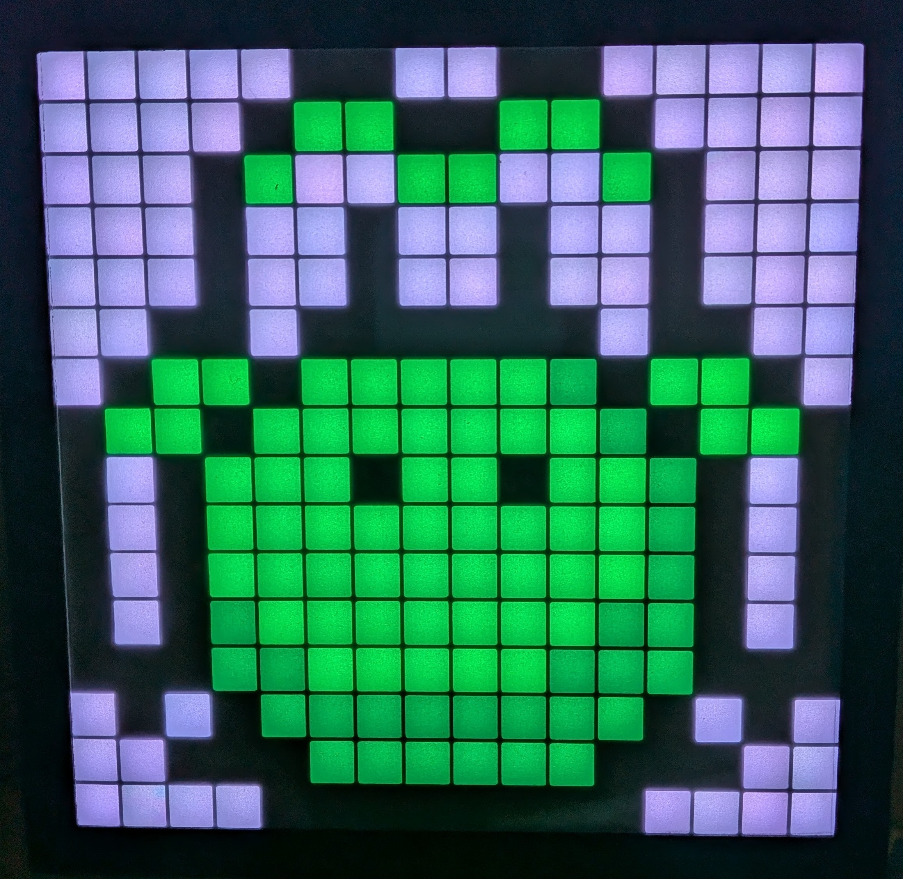

# PixelBox

A Bluetooth-controlled PixelArt display (16x16 pixels) powered by **ESP32** and **WS2812B** LED matrix.

**Key Features:**
- 🎨 **Draw pixel art** instantly
- 🖼️ **Gallery Mode**: Slideshow of your saved arts
- 🕒 **Clock Mode**: Accurate time display with animations
- 💬 **Text Mode**: Scrolling text messages
- 🎮 **Games**: Tetris, Snake, Simon
- 🎵 **Audio Mode**: Visualizer for music

## Demo

  
  

▶️ [See video for clock mode](https://github.com/user-attachments/assets/048136df-9e7c-436d-b4ce-061c26e4e01e)

## Documentation

- [🔌 Hardware Setup](docs/hardware.md): Wiring diagram and component list.
- [📱 Web Control App](docs/webapp.md): User guide for the web interface.
- [📖 Development Setup](docs/development.md): How to build and flash the firmware.
- [📡 BLE Protocol](docs/protocol.md): Details on the frame format for each mode.

- [🎨 Gallery](docs/gallery.md): Examples of pixel art and sprites.

